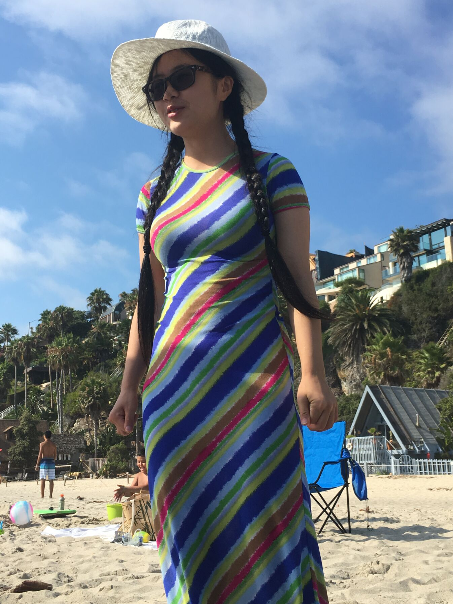

# Piao's CSE110

_Hi my name is Piao Xie, a fourth year cs major student in ucsd. I like playing video games, and hiking in my free time. ~~Also I like doing workout.~~_

 

#### LAB1 Contents
- [Part 1](#part-1)
- [Part 2](#part-2)
- [Part 3](#part-3)

##### Part 1
Installed the VScode and extensions.

##### Part 2
**Screenshot of command line git transactions**


**Screenshot of staged commit in VS Code**


##### Part 3
**Heading:**
# 哈

**Styling text:**
 ~~The stying text I like to use the most~~

**Quoting text:**
> "Tomorrow is another day."

**Quoting code: First code I learned:**
```
#include <iostream>

int main() {
    std::cout << "Hello World!" << std::endl;
    return 0;
}
```

**External link: Here's my favorite video game:**
[GUESSS WHAT] (https://store.steampowered.com/app/1158310/Crusader_Kings_III/)

**Section link:**
- [Part 1](#part-1)
- [Part 2](#part-2)
- [Part 3](#part-3)

**Relative link:**
 [Lab 1] (Lab1.md)

**Ordered List of my course this quarter:**
1. CSE107
2. CSE110
3. CSE130
4. CSE141
5. CSE141l
6. CSE150B

**Unordered List of my favorate animal:**
* panda
* dog
* cat
* ~~you~~

**Task list: Three things I have to do in my life:**
- [x] Bungee Jumping
- [ ] Go to the South Pole
- [ ] Viewing the Earth from outer space ~~Soooo Expensive I'll do it in my next life~~
